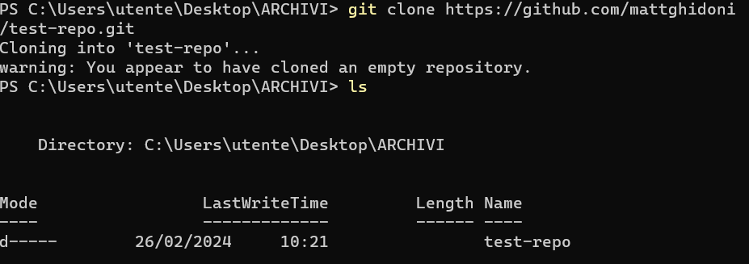
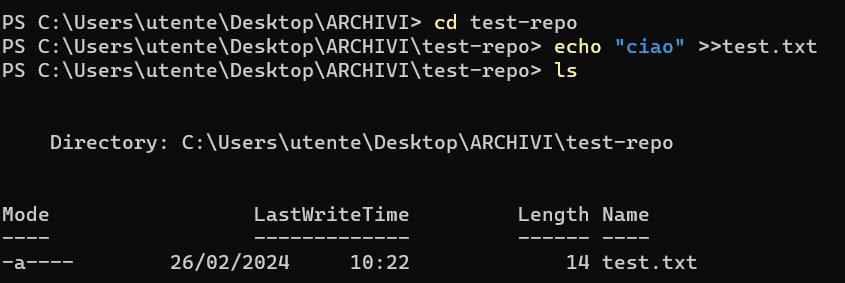

# 🕰️ CHANGE LOG

26/02/2024 - Mattia Ghidoni

## CARICAMENTO NUOVA REPOSITORY
- Una volta scaricato l'applicativo di Git hub, è stata creata dal sito una nuova repository chiamata `test-repo`.
- Tramite il prompt dei comandi è possibile visualizzare che sulla nostra macchina fosse stasto installato correttamente l'applicativo con il seguente comando:
    ```sh
    git --version
    ```
 
 - Una volta verificato ciò, la repository presente sul sito github è stata clonata sulla nostra macchina nella cartella `ARCHIVI` tramite il seguente comando (il link usato è quello della repository creata presente sul sito github):

    

- Per creare e mettere un nuovo file all'interno della cartella archivio, è stato utilizzato da prompt dei comandi il seguente comando:

    

- Sempre tramite il prompt dei comandi, sono state aggiunte le modifiche presenti sulla repository locale a quella originale tramite il seguente comando:
    ```sh
    git add.
    ```
- Ora è necessario copiare il nuovo file all'interno della repository originale presente sul sito Git hub e confermare quest'ultima scelta.

    

- Per aprire la repository su Fork, è necessario copiare il link della repository dal sito di Github e, tramite applicativo Fork, andare su File e Clone, per poi incollare il link.

## CREAZIONE DEL READ ME
- Ho creato il `README` tramite prompt dei comandi con :
    ```sh
    echo "prova">>README.md
    ```
- Da VSCODE era possibile vedere il nuovo file.
- Ho inserito del testo al suo interno.
- Ho salvato il tutto da VSCODE tramite Ctrl + S.
- Da Fork è stato messo in `Staged`.

## CREAZIONE DEL CHANGE LOG
- Ho creato il `CHANGE LOG` tramite il prompt dei programmi di VSCODE con:
    ```sh
    echo "prova">>CHANGELOG.md
    ```

- Da VSCODE era possibile vedere il nuovo file.
- Ho inserito del testo al suo interno.
- Ho salvato il tutto da VSCODE tramite Ctr + S.
- Da fork è stato messo in `Staged`.